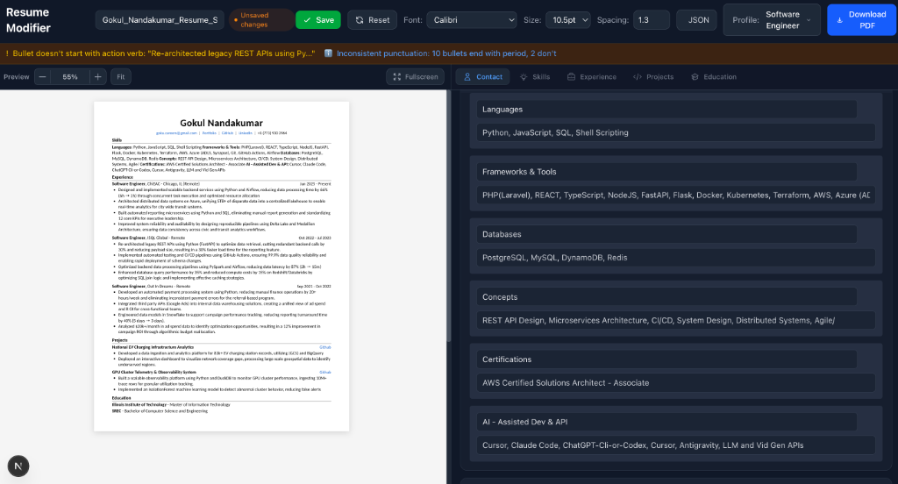
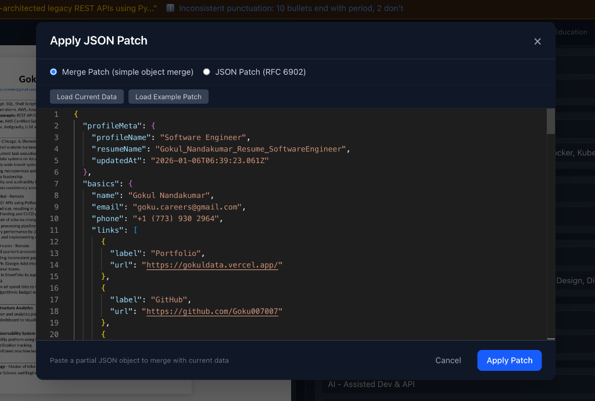

<p align="center">
  <h1 align="center">Resume Modifier</h1>
  <p align="center">
    <strong>A powerful, local-first resume editing application</strong><br>
    Built to solve the pain of tailoring resumes for different job applications
  </p>
</p>

<p align="center">
  
  
  
  
  
</p>

---

## The Problem

As a job seeker applying to multiple roles, I faced a common challenge:

- **Each job requires a tailored resume** — different keywords, different emphasis
- **Managing multiple resume versions** becomes a nightmare in Word/Google Docs
- **No live preview** means constant export-and-check cycles
- **ATS optimization** requires tracking which skills are highlighted per role
- **Version control** is non-existent in traditional tools

## The Solution

I built **Resume Modifier** — a local-first web application that treats resumes as **structured data**, not documents.

### Key Innovations:
- **Profile-based system**: Create dedicated profiles for "Software Engineer", "Data Engineer", "Full-Stack" etc.
- **Live PDF preview**: See exactly how your resume will look while editing
- **Skills extraction panel**: Instantly see all technologies mentioned across your resume
- **JSON-powered editing**: Paste JSON patches to make bulk updates programmatically
- **Resume linting**: Automatic quality checks (action verbs, bullet consistency, length warnings)

---

## Screenshots

### Main Editor View
*Two-column layout with live preview, skills extraction, and profile management*



### JSON Patch Modal
*Paste JSON to make precise, programmatic updates to your resume*



---

## Features

| Feature | Description |
|---------|-------------|
| **Live Preview** | Two-column WYSIWYG editing with real-time PDF preview |
| **Profile Management** | Create, duplicate, rename role-specific resume profiles |
| **JSON Patch** | Apply merge patches or RFC 6902 operations for bulk edits |
| **Skills Panel** | Auto-extracted tech stack from all resume sections |
| **Resume Linter** | Quality warnings: action verbs, consistency, length |
| **PDF Export** | One-click PDF generation via Playwright |
| **Local Storage** | All data stays on your machine (SQLite) |
| **Keyboard Navigation** | Click any field in preview to jump to edit form |

---

## Tech Stack

### Frontend
- **Next.js 14** — React framework with App Router
- **TypeScript** — Type-safe development
- **Tailwind CSS** — Utility-first styling
- **Monaco Editor** — VS Code's editor for JSON editing

### Backend & Data
- **SQLite (better-sqlite3)** — Local database for profiles
- **Playwright** — Headless browser for pixel-perfect PDF export
- **Ajv** — JSON Schema validation
- **fast-json-patch** — RFC 6902 JSON Patch implementation

### Architecture Decisions
- **Local-first**: No cloud dependencies, all data on your machine
- **Structured data**: Resume stored as JSON, not as a document
- **Profile isolation**: Each role profile is independent
- **Real-time sync**: Changes reflect instantly in preview

---

## Quick Start

```bash
# Clone the repository
git clone https://github.com/Goku007007/resume-creator-modifier.git
cd resume-creator-modifier

# Install dependencies
npm install

# Install Playwright browsers (for PDF export)
npx playwright install chromium

# Start development server
./start.sh
# OR
npm run dev
```

The app will be available at `http://localhost:3001`

---

## Project Structure

```
resume-modifier/
├── app/                    # Next.js App Router pages
│   ├── page.tsx           # Main editor page
│   └── api/               # API routes (PDF generation, DB ops)
├── components/            # React components
│   ├── ResumePreview/     # Live preview renderer
│   ├── ResumeForm/        # Edit forms for each section
│   └── JsonPatchModal/    # JSON editing modal
├── lib/                   # Core utilities
│   ├── db.ts             # SQLite database operations
│   ├── resume-linter.ts  # Quality checking logic
│   └── json-patch.ts     # Patch application logic
├── types/                 # TypeScript type definitions
└── scripts/              # Data import/export scripts
```

---

## Resume JSON Schema

The application uses a structured JSON format for resume data:

```typescript
interface ResumeJSON {
  profileMeta: {
    profileName: string;      // e.g., "Software Engineer"
    resumeName: string;       // Filename for PDF
    updatedAt: string;
  };
  basics: {
    name: string;
    email: string;
    phone: string;
    links: Array<{ label: string; url: string }>;
  };
  sections: {
    skills: {
      heading: string;
      groups: Array<{ label: string; items: string[] }>;
    };
    experience: Array<{
      company: string;
      location: string;
      title: string;
      start: string;
      end: string | null;
      bullets: string[];
      tech?: string[];
    }>;
    projects: Array<{
      name: string;
      link?: string;
      bullets: string[];
    }>;
    education: Array<{
      school: string;
      degree: string;
    }>;
  };
  rendering: {
    fontFamily: string;
    fontSize: number;
    lineHeight: number;
    pageSize: "LETTER" | "A4";
    density: "COMPACT" | "NORMAL" | "SPACIOUS";
  };
}
```

---

## JSON Patch Examples

### Merge Patch (Simple Updates)
```json
{
  "basics": {
    "name": "New Name"
  },
  "sections": {
    "skills": {
      "groups": [
        { "label": "Languages", "items": ["Python", "TypeScript", "SQL"] }
      ]
    }
  }
}
```

### RFC 6902 Patch (Precise Operations)
```json
[
  { "op": "replace", "path": "/basics/name", "value": "New Name" },
  { "op": "add", "path": "/sections/experience/0/bullets/-", "value": "New achievement" },
  { "op": "remove", "path": "/sections/projects/2" }
]
```

---

## Data Storage

All data is stored locally in SQLite:
```
~/Library/Application Support/resume-modifier/data.db
```

---

## Development

```bash
# Run development server
npm run dev

# Build for production
npm run build

# Run linting
npm run lint
```

---

## License

MIT

---

<p align="center">
  <sub>Built by <a href="https://github.com/Goku007007">Gokul Nandakumar</a></sub>
</p>
